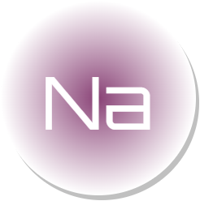
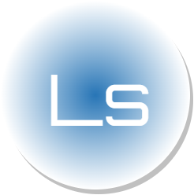
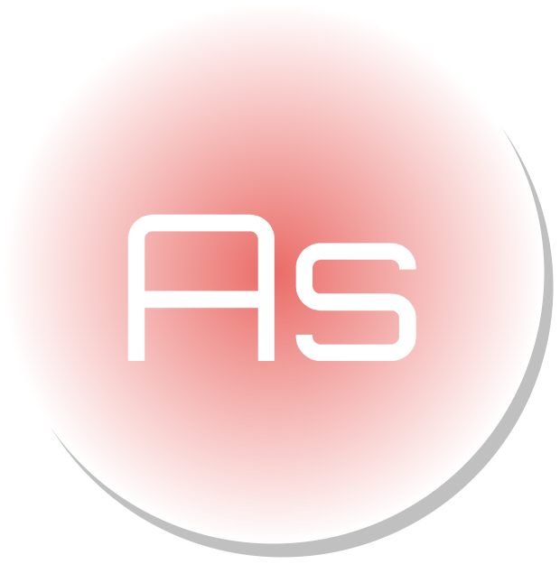
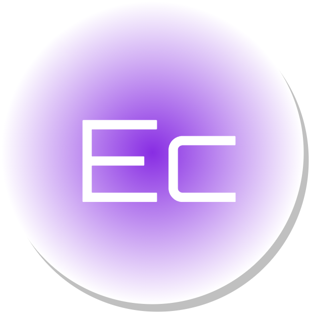

# About Me

I'm a programmer.

# Product List

<table style="width:100%">
  <tr style="border:none; background-color:#fff">
    <td style="border:none">
        
    </td>
    <td style="border:none">
        A python server that provides NLP-related APIs.
    </td>
  </tr>
  <tr style="border:none; background-color:#fff">
    <td style="border:none">
        
    </td>
    <td style="border:none">
        A simple ocr translator powered by avernakis react.
    </td>
  </tr>
  <tr style="border:none; background-color:#fff">
    <td style="border:none">
        
    </td>
    <td style="border:none">
        A simple image diff tool powered by avernakis.
    </td>
  </tr>
  <tr style="border:none; background-color:#fff">
    <td style="border:none">
        
    </td>
    <td style="border:none">
        A python server that provides ASR-related APIs.
    </td>
  </tr>
   <tr style="border:none; background-color:#fff">
    <td style="border:none">
        
    </td>
    <td style="border:none">
        A simple asr translator powered by avernakis react.
    </td>
  </tr>
</table>

# Blog List

- 2023/2/13 - [Announcing NLP-API 1.0.1](./blog/nlp-api-1.0.1/README.md)
- 2023/2/18 - [发布文影 (Language Shadow) 1.0.0](./blog/language-shadow-1.0.0/README.md)
