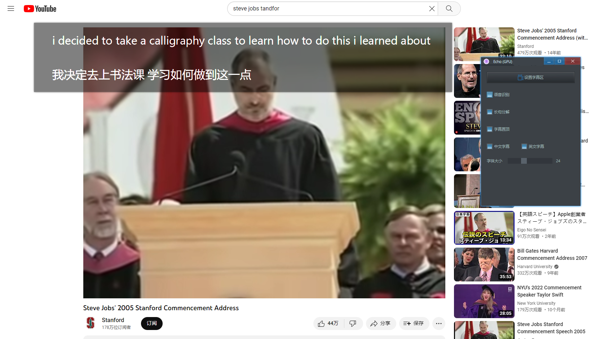

    

## 简介

回声 (Echo) 是一个简单的翻译器，它通过语音识别文字，然后再使用本地翻译服务器进行翻译。它有以下特点：

- 完全离线、免费且开源(项目地址：[https://github.com/rerender2021/echo](https://github.com/rerender2021/echo))
- 使用方便：解压缩后双击 exe 即可使用

<!-- 演示视频见:

- [文影：实时英语字幕翻译](https://www.bilibili.com/video/BV1Cs4y1j7Qb/) -->

## 安装

- 运行环境要求：至少 Windows 10
- 下载地址（根据实际需要选择完整下载或仅升级）：[Release 1.0.0](https://github.com/rerender2021/echo/releases/tag/1.0.0)

下载后双击exe即可运行。

## 功能说明

### 设置字幕区

点击「 设置字幕区 」，用鼠标「 自左上向右下 」选择一块区域，这块区域将生成一个字幕区：

<video src="./assets/select-area.mp4" controls autoplay style="width: 800px"></video>

生成的字幕框可以拖动边缘来调整大小。

### 语音识别

开启语音识别后字幕区会有英文字幕和中文翻译，关闭后字幕区不再更新。注意：首次开启可能会等待一段时间才会出字幕。

### 标点恢复

默认情况下，语音识别出的英文是没有标点的，这会影响翻译的准确性。勾选「 标点恢复 」可生成带标点的英文，优点是翻译更准确，但缺点也很明显：耗时会增加。

### 字幕置顶

默认情况下，生成的字幕框始终会在窗口最上层。如果这不是想要的，那么可以自己切换：

### 自定义超时时间

默认情况下，如果 4s 都没能完成一次 语音识别或翻译，那么此次翻译将跳过。这个时间可根据自己的设备来调整，只需用文本编辑器打开`config.json`，编辑 `timeout` 后的数值。注意单位是毫秒（ms）。

## 使用心得

- 如果视频速度太快，翻译跟不上，可以将视频速度调慢一些
- 此软件不能多开，不然会使用异常，无法翻译

## 赞赏

`:)` 如果此软件值得赞赏，可以请作者看小说，一元足足可看八章呢。

    

