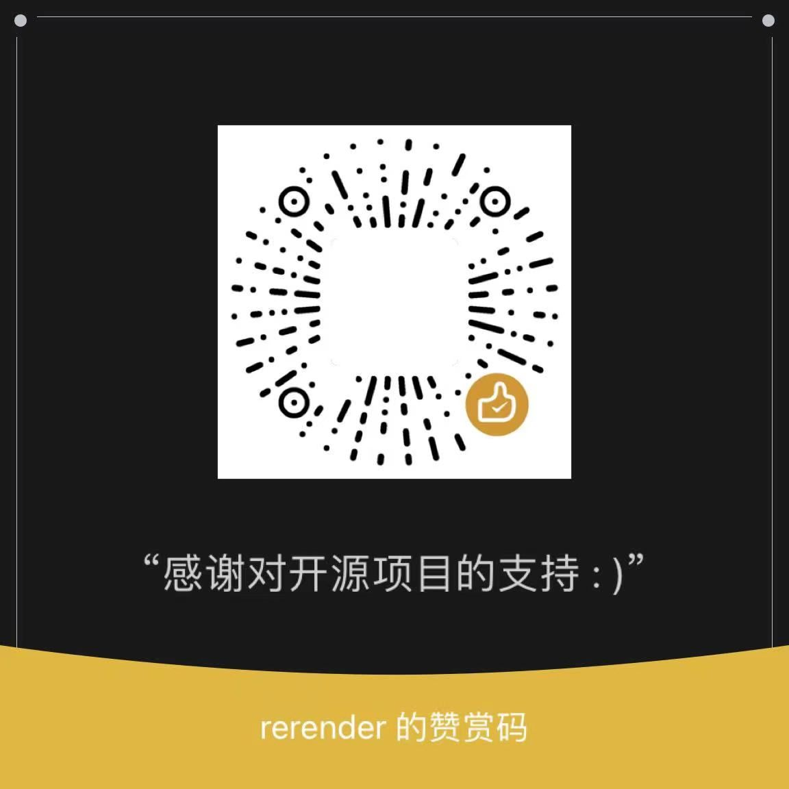

<p align="center">
    
</p>

## 简介

回声 (Echo) 是一个简单的翻译器，它通过语音识别文字，然后再使用本地翻译服务器进行翻译。它有以下特点：

- 完全离线、免费且开源(项目地址：[https://github.com/rerender2021/echo](https://github.com/rerender2021/echo))
- 使用方便：解压缩后双击 exe 即可使用


演示视频见:

- v1.0.0: [回声：实时英语语音翻译](https://www.bilibili.com/video/BV11L411d7HE/)

- v1.1.0: [回声更新：支持使用GPU & 长句分解](https://www.bilibili.com/video/BV1Qa4y1M7jV/)


## 环境准备

- 系统环境要求：至少 Windows 10
- 运行环境要求
    - GPU：如果希望GPU模式运行，需要 cuda 环境，版本 11.7：[cuda-11-7-0-download](https://developer.nvidia.com/cuda-11-7-0-download-archive?target_os=Windows&target_arch=x86_64)
需要注意验证 cuda 是否成功安装，方法：命令行输入 `nvcc -V`，看输出：
```
  Copyright (c) 2005-2022 NVIDIA Corporation
  Built on Tue_May__3_19:00:59_Pacific_Daylight_Time_2022
  Cuda compilation tools, release 11.7, V11.7.64
  Build cuda_11.7.r11.7/compiler.31294372_0
```

## 设置

需要将电脑上声音的输入设备设置为「 立体声混音 」：


## 下载安装

环境准备好后，下载：

- 语音识别服务器：[ASR-API 1.1.0](https://github.com/rerender2021/ASR-API/releases/download/1.1.0/asr-server-v1.1.0.zip)

- 翻译服务器（任选其一）
  - GPU 版：下载链接中的2个压缩分卷并解压缩（文件太大，只能分卷压缩上传）
    - [NLP-GPU-API 1.0.0](https://github.com/rerender2021/NLP-GPU-API/releases/tag/1.0.0) 
  
  - CPU 版：下载后注意重命名文件夹名，见以下目录结构说明
    - [NLP-API 1.0.1](https://github.com/rerender2021/NLP-API/releases/download/1.0.1/NLP-API-v1.0.1.zip)

- 回声 (Echo) 下载地址：[Release 1.1.0](https://github.com/rerender2021/echo/releases/tag/1.1.0)

最后，确保目录结构是这样的：

CPU模式：
```
- asr-server-v1.1.0
    - ...其它文件
    - ASR-API.exe
- nlp-server
    - ...其它文件
    - NLP-API.exe
- echo-v1.1.0.exe
```

GPU模式：
```
- asr-server-v1.1.0
    - ...其它文件
    - ASR-API.exe
- nlp-gpu-server
    - ...其它文件
    - NLP-GPU-API.exe
- echo-v1.1.0.exe
```

然后双击 exe 即可运行。

成功运行并使用GPU后，窗口标题文字会包含GPU：Echo (GPU)。


## 功能说明

### 设置字幕区

点击「 设置字幕区 」，用鼠标「 自左上向右下 」选择一块区域，这块区域将生成一个字幕区：

<video src="./assets/select-area.mp4" controls autoplay style="width: 800px"></video>

生成的字幕框可以拖动边缘来调整大小。

### 语音识别

开启语音识别后字幕区会有英文字幕和中文翻译，关闭后字幕区不再更新。注意：首次开启可能会等待一段时间才会出字幕。

### 长句分解

默认情况下，语音识别出的英文会是一大段话，这会影响翻译的速度和准确性。勾选「 长句分解 」可分解为短句。


### 字幕置顶

默认情况下，生成的字幕框始终会在窗口最上层。如果这不是想要的，那么可以自己切换。

### 自定义超时时间

默认情况下，如果 3.5s 都没能完成一次 语音识别或翻译，那么此次翻译将跳过。这个时间可根据自己的设备来调整，只需用文本编辑器打开`config.json`，编辑 `timeout` 后的数值。注意单位是毫秒（ms）。

## 问题诊断

如遇无法正常使用，可下载对应版本的调试包进行问题排查，方法是：下载`echo-vx.x.x-debug-exe.zip`，双击打开exe，在弹出的小黑窗中会有详细报错信息，将其截图，然后进行问题反馈。

## 使用心得

- 如果视频速度太快，翻译跟不上，可以将视频速度调慢一些
- 此软件不能多开，不然会使用异常，无法翻译

## 赞赏

`:)` 如果此软件值得赞赏，可以请作者看小说，一元足足可看八章呢。

<p align="left">
    
</p>


