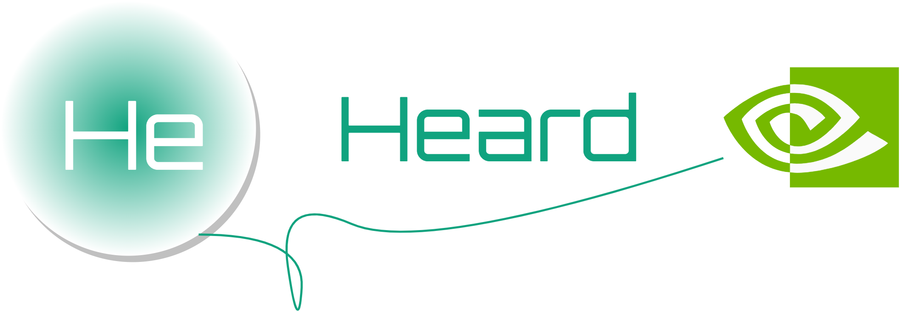
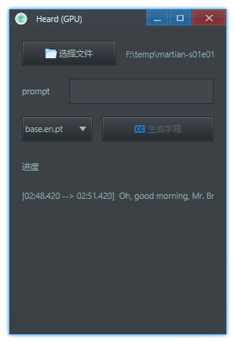
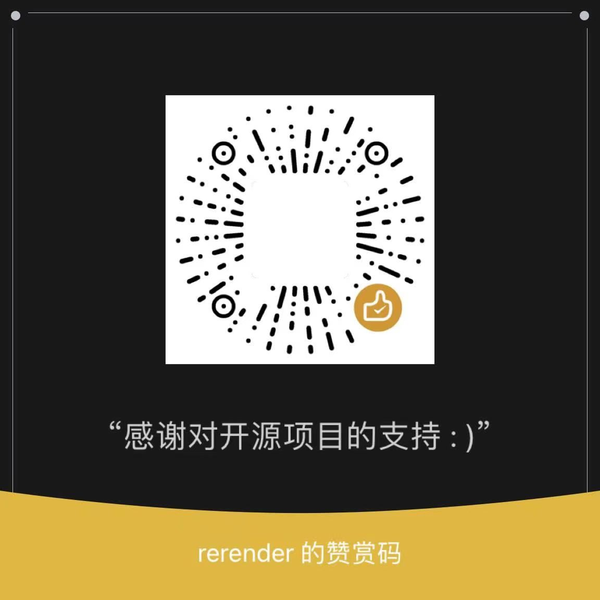

<p align="center">
    
</p>

## 简介

听到了! (Heard) 是一个字幕生成工具，它基于 [Whisper](https://github.com/openai/whisper) ，支持使用 GPU。有以下特点：

- 完全离线、免费且开源(项目地址：[https://github.com/rerender2021/heard](https://github.com/rerender2021/heard))
- 使用方便：解压缩后双击 exe 即可使用



演示视频见:

- [听到了！Whisper & GPU 离线字幕提取](https://www.bilibili.com/video/BV1FN411N7a5/)

## 环境准备

- 系统环境要求：至少 Windows 10
- 运行环境要求
  - GPU：需要 cuda 环境，版本 11.7：[cuda-11-7-0-download](https://developer.nvidia.com/cuda-11-7-0-download-archive?target_os=Windows&target_arch=x86_64)
  - ffmpeg：这个应该没有版本强要求: [https://ffmpeg.org/](https://ffmpeg.org/)

需要注意验证 cuda 和 ffmpeg 是否成功安装，方法：

- 验证 cuda 安装成功：命令行输入 `nvcc -V`，看输出：

```bash
  Copyright (c) 2005-2022 NVIDIA Corporation
  Built on Tue_May__3_19:00:59_Pacific_Daylight_Time_2022
  Cuda compilation tools, release 11.7, V11.7.64
  Build cuda_11.7.r11.7/compiler.31294372_0
```

- 验证 ffmpeg 存在（可能要自己手动添加环境变量），命令行输入：`ffmpeg -v`

```bash
ffmpeg version 2022-02-10-git-b6bb6b9f22-full_build-www.gyan.dev Copyright (c) 2000-2022 the FFmpeg developers
  built with gcc 11.2.0 (Rev7, Built by MSYS2 project)
  ...
```

## 下载安装

环境准备好后，下载：

- 本地离线 Whisper 服务器：[Whisper-API 1.0.0](https://github.com/rerender2021/Whisper-API/releases/tag/1.0.0)

- 听到了! (Heard) 下载地址：[Release 1.0.1](https://github.com/rerender2021/heard/releases/tag/1.0.1)

最后，确保目录结构是这样的：

```
- whisper-gpu-server
    - ...其它文件
    - Whisper-API.exe
- heard-v1.0.1.exe
```

然后双击 exe 即可运行。

成功运行并使用GPU后，窗口标题文字会包含GPU：Heard (GPU)。

也可加qq群：949175734，在群文件中下载

## 功能说明

### 生成字幕

<video src="./assets/generate-subtitle.mp4" controls autoplay style="width: 800px"></video>

- 选择文件：可以通过点击按钮选择文件，也可以拖拽释放文件，选择一个音频/视频文件后会显示其路径
- 生成字幕：点击生成字幕，下面会显示进度，以及提示是否成功生成

生成的字幕文件位置：和所选择的输入文件同一文件夹，格式为 srt。

额外生成的 `*.subtitle.json` 文件：包含详细的识别出的字幕的各种信息。通常使用者不需要关心，如果需要自己编程处理字幕，才需要使用这个文件。

### 模型切换

<video src="./assets/change-model.mp4" controls autoplay style="width: 800px;height:300px"></video>

自带的 `base.en.pt` 是仅识别英语的模型，如果想识别其它语言的，就需要切换模型。

点击下拉框可以选择其它模型，`base.pt` 是自带的多语言模型，可以识别中文、日语等。

### 扩展：使用其它模型

默认支持 Whisper 类型为 base 的模型（英语 & 多语言），如果需要使用其它模型，可自行下载，并放在 `whisper-gpu-server\model` 下。

-   模型下载地址：[whisper/discussions/63](https://github.com/openai/whisper/discussions/63#discussioncomment-3798552)


### prompt（提示语）

识别中文的时候，有时候会出现识别结果是繁体中文的情况，这个时候需要在prompt中输入 「 以下是普通话的句子。」

这样识别后的结果才是简体中文。

## 问题诊断

如遇无法正常使用，可下载对应版本的调试包进行问题排查，方法是：下载`heard-vx.x.x-debug-exe.zip`，双击打开 exe，在弹出的小黑窗中会有详细报错信息，将其截图，然后进行问题反馈。

也可以加qq群反馈：949175734。

## 常见问题

如果遇到无法使用的情况，可以先参考这里的解决方法：

- 安装：注意安装路径中不能有中文
- 排查过程中，控制台报错信息是乱码：将系统语言设置为英文，看控制台中报错乱码是否消失
- 代理相关：报错特征如下：

```bash
ERROR: Exception in ASGI application

ssl.SSLError: [SSL: WRONG_VERSION_NUMBER] wrong version number (_ssl.c:1131)

requests.exceptions.ProxyError: HTTPSConnectionPool(host='openaipublic.blob.core.windows.net', port=443): Max retries exceeded with url: /gpt-2/encodings/main/vocab.bpe (Caused by ProxyError('Your proxy appears to only use HTTP and not HTTPS, try changing your proxy URL to be HTTP.
```

这种情况是电脑开了代理软件，需要关闭全局代理。

## 赞赏

`:)` 如果此软件值得赞赏，可以请作者看小说，一元足足可看八章呢。

<p align="left">
    
</p>