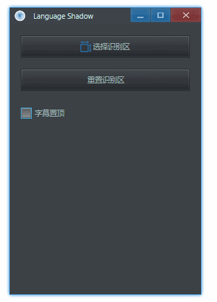
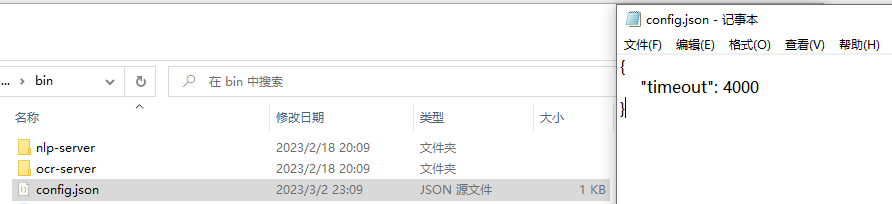

    

## 简介

文影 (Language Shadow) 是一个简单的翻译器，它通过 OCR 识别字幕文字，然后再使用本地翻译服务器进行翻译。它有以下特点：

- 完全离线、免费且开源(项目地址：[https://github.com/rerender2021/language-shadow](https://github.com/rerender2021/language-shadow))
- 使用方便：解压缩后双击 exe 即可使用

演示视频见:

- [文影：实时英语字幕翻译](https://www.bilibili.com/video/BV1Cs4y1j7Qb/)

## 安装

- 运行环境要求：至少 Windows 10
- 下载地址（根据实际需要选择完整下载或仅升级）：[Release 1.1.0](https://github.com/rerender2021/language-shadow/releases/tag/1.1.0)
  - 也可加qq群：949175734，在群文件中下载

下载后双击exe即可运行。

## 功能说明

### 选择识别区

点击「 选择识别区 」，用鼠标「 自左上向右下 」选择一块区域，这块区域的文字将被识别并翻译：

生成的字幕框可以拖动边缘来调整大小。

### 重置识别区

如果不小心选择识别区的时候失误，除了重新选择，还可以直接调整字幕框大小后，点击「 重置识别区 」：

### 字幕置顶

默认情况下，生成的字幕框始终会在窗口最上层。如果这不是想要的，那么可以自己切换：

### 自定义超时时间

默认情况下，如果 4s 都没能完成一次 OCR 文字识别或翻译，那么此次翻译将跳过。这个时间可根据自己的设备来调整，只需用文本编辑器打开`config.json`，编辑 `timeout` 后的数值：

注意单位是毫秒（ms）。

## 注意事项

- 视频速度：如果视频速度太快，翻译跟不上，可以将视频速度调慢一些

## 常见问题

如果遇到无法使用的情况，可以先参考这里的解决方法：

1. 安装：注意安装路径中不能有中文
2. 多开：需要注意是否不小心打开了多次，此软件不能多开，不然会使用异常，无法翻译
3. 排查过程中，控制台报错信息是乱码：将系统语言设置为英文，看控制台中报错乱码是否消失
4. DLL load failed while importing libpaddle: xxx DLL：检查自己电脑是否支持avx指令集，太老的电脑不支持

也可以加qq群反馈：949175734。

## 赞赏

`:)` 如果此软件值得赞赏，可以请作者看小说，一元足足可看八章呢。

    

