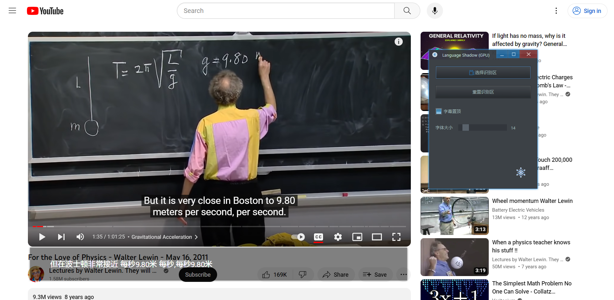
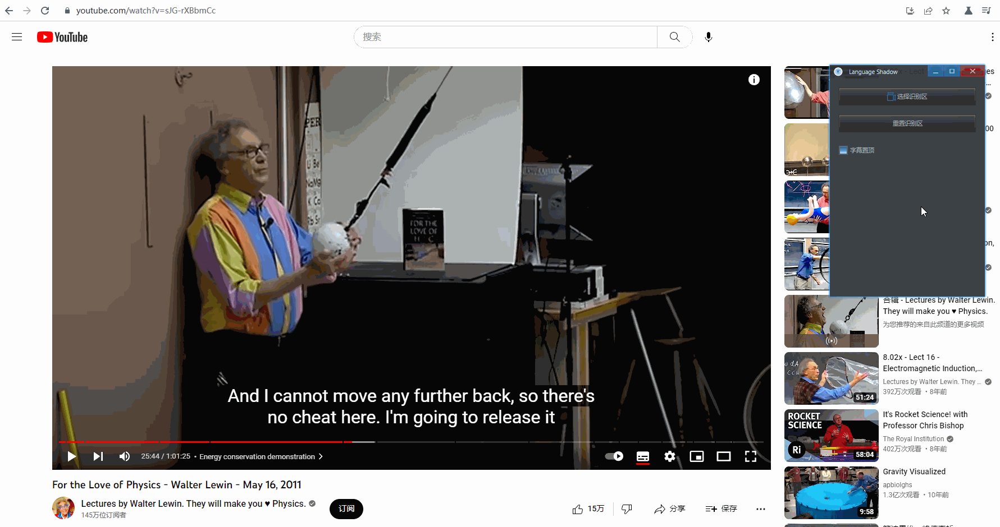
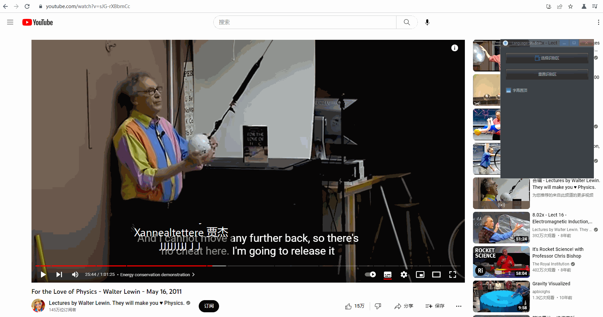

<p align="center">
    
</p>

## 简介

文影 (Language Shadow) 是一个简单的翻译器，它通过 OCR 识别字幕文字，然后再使用本地翻译服务器进行翻译。它有以下特点：

- 完全离线、免费且开源(项目地址：[https://github.com/rerender2021/language-shadow](https://github.com/rerender2021/language-shadow))
- 使用方便：解压缩后双击 exe 即可使用



演示视频见:

-   v1.0.0: [文影：实时英语字幕翻译 - 完全离线、免费且开源](https://www.bilibili.com/video/BV1Cs4y1j7Qb/)
-   v1.2.0: [文影更新：支持GPU & 历史字幕](https://www.bilibili.com/video/BV1kC4y1X78Q/)

## 环境准备

- 系统环境要求：至少 Windows 10
- 运行环境要求
    - GPU：如果希望GPU模式运行，需要 cuda 环境，版本 11.7：[cuda-11-7-0-download](https://developer.nvidia.com/cuda-11-7-0-download-archive?target_os=Windows&target_arch=x86_64)
需要注意验证 cuda 是否成功安装，方法：命令行输入 `nvcc -V`，看输出：
```
  Copyright (c) 2005-2022 NVIDIA Corporation
  Built on Tue_May__3_19:00:59_Pacific_Daylight_Time_2022
  Cuda compilation tools, release 11.7, V11.7.64
  Build cuda_11.7.r11.7/compiler.31294372_0
```

## 安装

环境准备好后，下载：

- OCR 服务器：[OCR-API 1.0.1](https://github.com/rerender2021/PaddleocrAPI/releases/download/1.0.1/PaddleocrAPI.zip)

- 翻译服务器（任选其一）
  - GPU 版：下载链接中的2个压缩分卷并解压缩（文件太大，只能分卷压缩上传）
    - [NLP-GPU-API 1.0.0](https://github.com/rerender2021/NLP-GPU-API/releases/tag/1.0.0) 
  
  - CPU 版：下载后注意重命名文件夹名，见以下目录结构说明
    - [NLP-API 1.0.1](https://github.com/rerender2021/NLP-API/releases/download/1.0.1/NLP-API-v1.0.1.zip)

- 文影 (Language Shadow) 下载地址：[Release 1.2.0](https://github.com/rerender2021/language-shadow/releases/tag/1.2.0)

也可加qq群：949175734，在群文件中下载

最后，确保目录结构是这样的：

CPU模式：
```
- ocr-server
    - ...其它文件
    - PaddleocrAPI.exe
- nlp-server
    - ...其它文件
    - NLP-API.exe
- language-shadow-web-ui-v1.2.0
- language-shadow-v1.2.0.exe
```

GPU模式：
```
- ocr-server
    - ...其它文件
    - PaddleocrAPI.exe
- nlp-gpu-server
    - ...其它文件
    - NLP-GPU-API.exe
- language-shadow-web-ui-v1.2.0
- language-shadow-v1.2.0.exe
```

然后双击 exe 即可运行。

成功运行并使用GPU后，窗口标题文字会包含GPU：Language Shadow (GPU)。

## 功能说明

### 选择识别区

点击「 选择识别区 」，用鼠标「 自左上向右下 」选择一块区域，这块区域的文字将被识别并翻译：



生成的字幕框可以拖动边缘来调整大小。

### 重置识别区

如果不小心选择识别区的时候失误，除了重新选择，还可以直接调整字幕框大小后，点击「 重置识别区 」：



### 字幕置顶

默认情况下，生成的字幕框始终会在窗口最上层。如果这不是想要的，那么可以自己切换：


### 自定义超时时间

默认情况下，如果 4s 都没能完成一次 OCR 文字识别或翻译，那么此次翻译将跳过。这个时间可根据自己的设备来调整，只需用文本编辑器打开`config.json`，编辑 `timeout` 后的数值：


注意单位是毫秒（ms）。

## 注意事项

- 视频速度：如果视频速度太快，翻译跟不上，可以将视频速度调慢一些

## 常见问题

如果遇到无法使用的情况，可以先参考这里的解决方法：

-  安装：注意安装路径中不能有中文
-  多开：需要注意是否不小心打开了多次，此软件不能多开，不然会使用异常，无法翻译
- 排查过程中，控制台报错信息是乱码：将系统语言设置为英文，看控制台中报错乱码是否消失
-  DLL load failed while importing libpaddle: xxx DLL：检查自己电脑是否支持avx指令集，太老的电脑不支持

也可以加qq群反馈：949175734。


## 赞赏

`:)` 如果此软件值得赞赏，可以请作者看小说，一元足足可看八章呢。

<p align="left">
    
</p>
