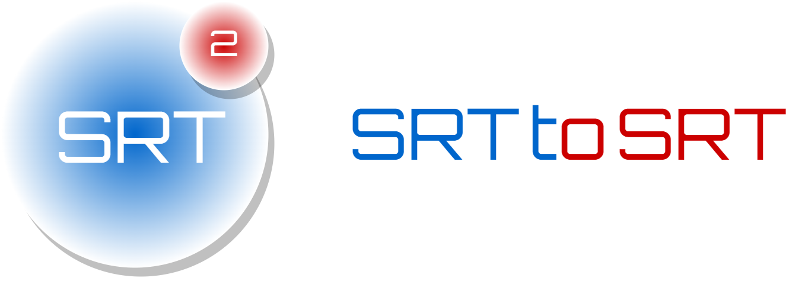
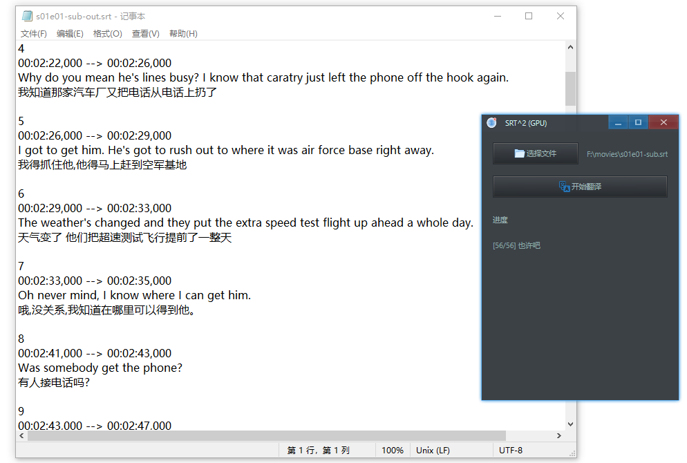

<p align="center">
    
</p>

## 简介

SRT to SRT (SRT^2) 是一个字幕翻译工具，它有以下特点：

- 完全离线、免费且开源(项目地址：[https://github.com/rerender2021/srt2srt](https://github.com/rerender2021/srt2srt))
- 使用方便：解压缩后双击 exe 即可使用



<!-- 演示视频见:

- [回声：实时英语语音翻译](https://www.bilibili.com/video/BV11L411d7HE/) -->

## 环境准备

- 系统环境要求：至少 Windows 10
- 运行环境要求
  - 如果离线翻译服务器希望使用GPU：需要 cuda 环境，版本 11.7：[cuda-11-7-0-download](https://developer.nvidia.com/cuda-11-7-0-download-archive?target_os=Windows&target_arch=x86_64)


需要注意验证 cuda 是否成功安装，方法：

- 命令行输入 `nvcc -V`，看输出：

```bash
  Copyright (c) 2005-2022 NVIDIA Corporation
  Built on Tue_May__3_19:00:59_Pacific_Daylight_Time_2022
  Cuda compilation tools, release 11.7, V11.7.64
  Build cuda_11.7.r11.7/compiler.31294372_0
```

## 下载安装

### SRT^2

- SRT to SRT (SRT^2) 下载地址：[Release 1.0.0](https://github.com/rerender2021/srt2srt/releases/tag/1.0.0)


### 离线翻译服务器

任选其一即可：

#### CPU

-   CPU 翻译服务器：https://github.com/rerender2021/NLP-API/releases/tag/1.0.1

最后，确保目录结构是这样的：

```
- nlp-server
    - NLP-API.exe
    - ... 其它文件
- srt2srt-v1.0.0.exe
```

#### GPU

-   GPU 翻译服务器：https://github.com/rerender2021/NLP-GPU-API/releases/tag/1.0.0
   
下载后，解压到项目下，确保项目目录结构如下：

```
- nlp-gpu-server
    - NLP-GPU-API.exe
    - ... 其它文件
- srt2srt-v1.0.0.exe
```

然后双击 exe 即可运行。

成功运行并使用GPU后，窗口标题文字会包含GPU：`SRT^2 (GPU)`。

## 功能说明

### 翻译字幕

<video src="./assets/translate-subtitle.mp4" controls autoplay style="width: 800px"></video>

- 选择文件：可以通过点击按钮选择文件，也可以拖拽释放文件，选择一个`.srt`文件后会显示其路径
- 翻译字幕：点击开始翻译，下面会显示进度

生成的字幕文件位置：和所选择的输入文件同一文件夹，特征为 `*-out.srt`。

## 问题诊断

如遇无法正常使用，可下载对应版本的调试包进行问题排查，方法是：下载`srt2srt-vx.x.x-debug-exe.zip`，双击打开 exe，在弹出的小黑窗中会有详细报错信息，将其截图，然后进行问题反馈。

## 使用心得

- 此软件不能多开，不然会使用异常

## 赞赏

`:)` 如果此软件值得赞赏，可以请作者看小说，一元足足可看八章呢。

<p align="left">
    
</p>